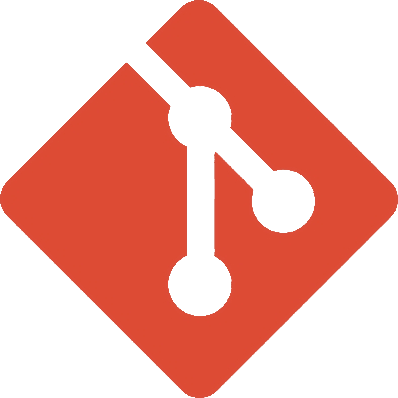

### 
 Hi there 👋, I'm Paul! 

I'm currently studing <b>Data Science</b> on <i>Warsaw University of Technology</i>, which matches my interest in that field. 

I'm into data analysis, developing <b>maschine-learning</b> architectures and <b>backend</b> applications.

## 🖨️ Languages and technologies:
<dl>
    <dt>
        <a href="https://www.python.org">&nbsp;Python</a>
    </dt>
    <dd>
        <a href="https://www.tensorflow.org">&nbsp;Tensorflow</a>
    </dd>
    <dd>
        <a href="https://scikit-learn.org/stable/">&nbsp;Scikit-learn</a>
    </dd>
    <dd>
        <a href="https://www.djangoproject.com">&nbsp;Django</a>
    </dd>
    <dt>
        <a href="https://git-scm.com">&nbsp;Git</a>
    </dt>
    <dt>
        <a href="https://www.gnu.org/software/bash/">&nbsp;Bash</a>
    </dt>
    <dt>
        <a href="https://en.wikipedia.org/wiki/SQL">&nbsp;SQL</a>
    </dt>
    <dt>
        <a href="https://www.docker.com">&nbsp;Docker</a>
    </dt>
</dl>

## 📫 How to reach me:
You can easily reach me at the mail in my github profile. Feel free to follow me on the LinkedIn!

<!--
**Pawlo77/Pawlo77** is a ✨ _special_ ✨ repository because its `README.md` (this file) appears on your GitHub profile.

Here are some ideas to get you started:

- 🔭 I’m currently working on ...
- 🌱 I’m currently learning ...
- 👯 I’m looking to collaborate on ...
- 🤔 I’m looking for help with ...
- 💬 Ask me about ...
- 📫 How to reach me: ...
- 😄 Pronouns: ...
- ⚡ Fun fact: ...
-->
