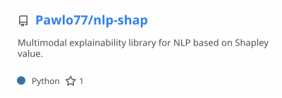
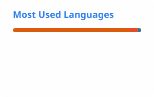

<div align="center">

# Paul Pozorski

**Data scientist & NLP researcher** · Warsaw

Explainable multimodal LLMs · applied ML · open-source research tooling

[](https://www.linkedin.com/in/pawel-pozorski)
[](https://orcid.org/0009-0007-0728-1043)
[](mailto:pozorski.paul@gmail.com)
[](https://pypi.org/search/?q=pozorski)

</div>

---

### Hi

I study **Data Science** (MSc) at [Warsaw University of Technology](https://www.mini.pw.edu.pl) — BSc with honors. I care about making **multimodal LLMs explainable** and turning research into tools people can actually install and reuse.

Most of my recent work sits at the intersection of **NLP**, **Shapley-value XAI**, and **practical data science**. I previously built [Botuj](https://botuj.pl) (AI chat + voice); I’m no longer actively developing it.

Roles & experience → [LinkedIn](https://www.linkedin.com/in/pawel-pozorski)

---

### Right now

- Extending **[nlp-shap](https://github.com/Pawlo77/nlp-shap)** — Shapley-style explainability for text / multimodal models
- Preparing the **ACL 2026** System Demonstration for *mllm-shap*
- Open to chats about XAI, reproducible AutoML, and local LLM tooling

---

### Selected work

<div align="center">
  <a href="https://github.com/Pawlo77/nlp-shap">
    
  </a>
  <a href="https://github.com/Pawlo77/lm-studio-dash">
    
  </a>
</div>

| | Project | What it is |
|---|---|---|
| **Flagship** | **[nlp-shap](https://github.com/Pawlo77/nlp-shap)** · [docs](https://pawlo77.github.io/nlp-shap/) · [PyPI](https://pypi.org/project/nlp-shap/) | Shapley-style explainability library for NLP / multimodal LLM pipelines |
| **Tools** | **[lm-studio-dash](https://github.com/Pawlo77/lm-studio-dash)** | Dashboard for local LM Studio usage, hardware, and chat analytics |
| **Tools** | **[AutoPrep](https://github.com/Pawlo77/AutoPrep)** · [PyPI](https://pypi.org/project/auto-prep/) | AutoML preprocessing, explainability, and LaTeX reporting |
| **Archive** | **[MLLM-Shap](https://github.com/Pawlo77/MLLM-Shap)** | Thesis / ACL predecessor of nlp-shap |
| **Coursework** | **[Galaxy-Images-Clustering](https://github.com/Pawlo77/Galaxy-Images-Clustering)** | Clustering low-resolution galaxy images (WUT) |

---

### Research

**mllm-shap: A Shapley Value Explainability Platform for Text-Audio Multimodal Large Language Models**  
ACL 2026 System Demonstrations — with Jakub Muszyński & Maria Ganzha

Attribution for text–audio multimodal LLMs: modality-aware masking, multi-turn conversation tracking, and phonetic audio grouping.

[nlp-shap](https://github.com/Pawlo77/nlp-shap) · [MLLM-Shap](https://github.com/Pawlo77/MLLM-Shap) · [Zenodo](https://zenodo.org/records/19678283) · [DOI](https://doi.org/10.5281/zenodo.19678283) · [ORCID](https://orcid.org/0009-0007-0728-1043)

<details>
<summary>Cite</summary>

```bibtex
@software{pozorski2026mllmshap,
  author    = {Pozorski, Pawe{\l} Dominik and Muszy{\'n}ski, Jakub Mi{\l}osz and Ganzha, Maria},
  title     = {mllm-shap: A Shapley Value Explainability Platform for Text-Audio Multimodal Large Language Models},
  year      = {2026},
  publisher = {Zenodo},
  doi       = {10.5281/zenodo.19678283},
  url       = {https://zenodo.org/records/19678283}
}
```

</details>

---

### Background

| | |
|---|---|
| Education | MSc Data Science @ WUT · BSc with honors |
| Built | [Botuj](https://botuj.pl) — AI chat + voice support |
| Cert | SnowPro Core |
| Based in | Warsaw |

---

### Tools

<div align="center">
  
</div>

<p align="center">
  <code>Python</code>
  <code>PyTorch</code>
  <code>scikit-learn</code>
  <code>Transformers</code>
  <code>FastAPI</code>
  <code>SQL</code>
  <code>Snowflake</code>
  <code>Docker</code>
  <code>Streamlit</code>
</p>

---

### Activity

<div align="center">





</div>

---

<div align="center">

**Thanks for stopping by.**  
Reach me on [LinkedIn](https://www.linkedin.com/in/pawel-pozorski) · [email](mailto:pozorski.paul@gmail.com) · [ORCID](https://orcid.org/0009-0007-0728-1043)  
Feedback welcome on [nlp-shap](https://github.com/Pawlo77/nlp-shap/issues).

</div>
